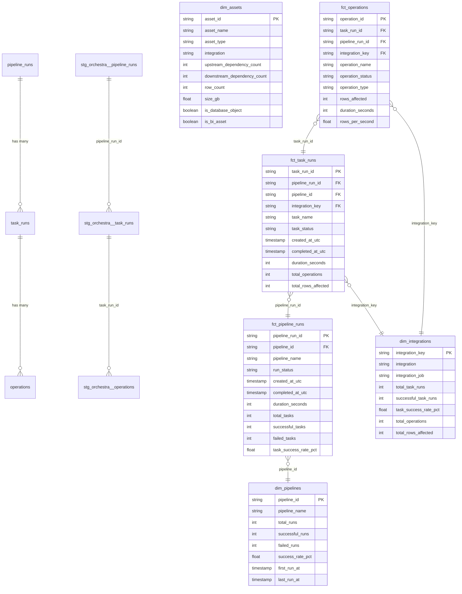

# dbt-orchestra-metadata
dbt Package for Orchestra metadata

## Overview

This dbt package transforms Orchestra platform metadata into an analytics-ready dimensional model. It processes execution metadata from Orchestra's REST API to provide insights into pipeline orchestration, data operations, and asset lineage.

### Data Sources

The package works with data ingested from the Orchestra API via [dlt](https://dlthub.com/) (data load tool). It processes four main data streams:

- **Pipeline Runs**: Execution metadata for orchestrated pipelines including status, timing, and git context
- **Task Runs**: Individual task executions within pipelines with integration-specific details
- **Operations**: Granular operation-level details including rows affected, duration, and operation types (ingestion, transformation, testing, etc.)
- **Assets**: Data asset catalog tracking tables, views, dashboards, and their upstream/downstream dependencies

Data is incrementally loaded with a 7-day lookback window for time-series data, ensuring fresh metrics while managing API load efficiently.

### Use Cases

This package enables several analytics and monitoring use cases:

**Pipeline Observability**
- Monitor pipeline success rates, failure trends, and execution duration patterns
- Identify pipelines with degrading performance or increasing failure rates
- Track which users or systems are triggering pipeline runs
- Analyze impact of git branches and commits on pipeline success

**Integration Performance Analysis**
- Compare performance across different integration types (dbt, Fivetran, Snowflake, etc.)
- Measure throughput (rows per second) for data operations
- Identify bottleneck integrations or operations in your data stack
- Track resource usage and operation duration by integration

**Data Lineage & Impact Analysis**
- Map upstream and downstream dependencies between data assets
- Identify source assets (no upstream dependencies) and terminal assets (no downstream consumers)
- Analyze data asset sizes and row counts across your data platform
- Track how assets flow through different integrations

**Operational Metrics & Reporting**
- Build executive dashboards showing data platform health
- Generate SLA reports on pipeline execution times and success rates
- Create alerts for anomalous execution patterns or failures
- Track operational metrics over time (daily/weekly/monthly aggregations)

**Resource Optimization**
- Identify long-running operations that could be optimized
- Analyze task and operation patterns to optimize pipeline scheduling
- Track which operations affect the most rows to understand data volumes

## Data Model

This package transforms Orchestra API data into a dimensional model for analytics. The diagram below shows the table structure and relationships:

### Layer Descriptions

**Source Layer**: Raw Orchestra API data ingested via dlt
- `pipeline_runs` - Pipeline execution metadata
- `task_runs` - Task execution within pipelines
- `operations` - Granular operation details within tasks
- `assets` - Data asset catalog with dependencies

**Staging Layer**: Cleaned and standardized source data
- `stg_orchestra__pipeline_runs` - Renamed columns, calculated durations, status flags
- `stg_orchestra__task_runs` - Enriched task data with references to pipelines
- `stg_orchestra__operations` - Operation details with categorization flags
- `stg_orchestra__assets` - Processed asset metadata with dependency counts

**Marts Layer**:
- **Dimensions**: Reference data for analytics
  - `dim_pipelines` - Pipeline definitions with aggregated stats
  - `dim_integrations` - Integration + job combinations with metrics
  - `dim_assets` - Asset catalog with dependency analysis

- **Facts**: Event-level data for analysis
  - `fct_pipeline_runs` - Pipeline execution events with task rollups
  - `fct_task_runs` - Task execution events with operation rollups
  - `fct_operations` - Granular operation events with throughput metrics
